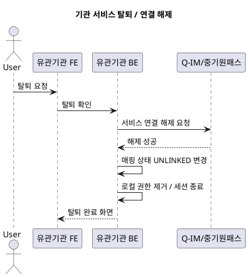

좋아 대영, 지금 상황( develop → main 머지 시 특정 디렉토리 변경을 무시하고 싶다 )에 맞춰  
**실제로 바로 사용할 수 있는 `.gitattributes` 완성본**을 만들어줄게.

아래 구성은 실무에서 가장 많이 쓰는 패턴이고,  
특히 운영 설정·배포 스크립트·환경 파일이 develop에서 오염되는 걸 막는 데 최적화돼 있어.

---

# ✅ `.gitattributes` 완성본 (실무용)

```
# ================================
#  Merge Strategy Control
#  특정 디렉토리/파일은 main 기준 유지
# ================================

# 운영 설정 파일은 main 기준 유지
src/main/resources/application-prod.yml merge=ours

# 배포 스크립트는 develop 변경 무시
deploy/** merge=ours

# 운영 서버용 설정/스크립트
infra/** merge=ours
config/** merge=ours

# 환경 변수 파일은 main 기준 유지
.env.production merge=ours
.env.prod merge=ours

# ================================
#  Text / Binary Handling
# ================================

# 자동 줄바꿈 처리
* text=auto

# 이미지/바이너리 파일은 merge 하지 않음
*.png binary
*.jpg binary
*.jpeg binary
*.gif binary
*.pdf binary
*.zip binary
*.jar binary
```

---

# ✅ `.git/config` 또는 repo-level config에 추가해야 하는 merge 전략

`.gitattributes`에서 `merge=ours`를 쓰려면  
Git에게 “ours 전략이 뭔지” 알려줘야 해.

로컬 repo 또는 서버 repo 설정에 아래 추가:

```
[merge "ours"]
    name = Keep ours merge
    driver = true
```

이 설정이 있어야:

- develop → main 머지 시
- `.gitattributes`에 지정한 파일/디렉토리는  
  **항상 main 버전 유지**
- develop에서 변경된 내용은 자동 무시

이렇게 동작해.

---

# 🧪 실제 머지 시 어떻게 보이냐?

예를 들어 develop에서 `config/app.yml`을 수정해도:

- PR에서 충돌이 나더라도
- Git은 자동으로 **main 버전(app.yml)** 을 선택
- develop 변경은 버려짐

즉, “머지 제외”는 아니지만  
**결과적으로 main 기준으로 고정되는 효과**가 생겨.

---

# 🔥 대영 프로젝트(smep-ufe) 기준 추천

PR 페이지 구조를 보면 운영 설정이 develop에서 바뀌면 안 되는 구조라서  
아래 3개는 반드시 넣는 걸 추천해.

```
src/main/resources/application-prod.yml merge=ours
deploy/** merge=ours
config/** merge=ours
```

이 세 개만 넣어도 운영 배포가 훨씬 안전해져.

---

필요하면
- develop → main 안전 머지 전략
- Gitea에서 PR 차단(CI) 규칙
- 운영/개발 브랜치 전략 설계

이런 것도 바로 만들어줄게 대영.

