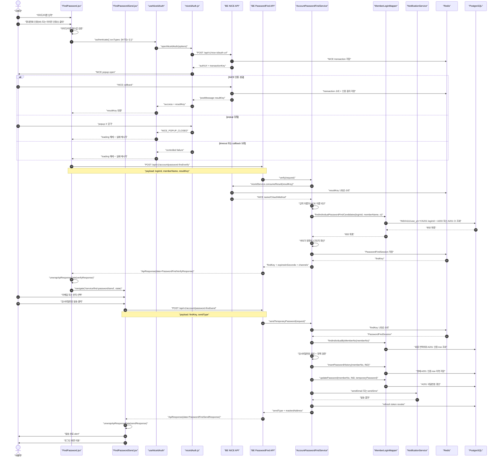

# 비밀번호 찾기 NICE 인증 흐름

## 1) 문서 목적

이 문서는 `비밀번호 찾기` 화면에서 개인회원이 NICE 인증을 완료한 뒤 임시비밀번호를 이메일 또는 문자로 발송받는 현재 구현 흐름을 정리합니다.

대상 화면은 `src/pages/FindPassword.jsx`입니다.

NICE 인증 popup 공통 처리는 `src/lib/niceIdAuth.js`와 `src/hooks/useNiceIdAuth.js`가 담당합니다.

비밀번호 찾기 후속 API는 `smep-be`의 `AccountPasswordFindController`, `AccountPasswordFindService`, `PasswordFindTokenStore`, `MemberLoginMapper.xml` 흐름을 탑니다.

현재 구현 범위는 개인회원입니다.

기업회원 공동인증서 기반 비밀번호 찾기는 아직 별도 계약이 닫히지 않았으므로 이 문서의 구현 범위에서 제외합니다.

알림톡은 비밀번호 찾기 발송 채널 범위가 아닙니다.

## 2) 현재 결론

NICE 인증 완료 후 사용자가 새 비밀번호를 직접 입력하는 재설정 흐름은 현재 비밀번호 찾기 화면의 목표 흐름이 아닙니다.

현재 목표 흐름은 NICE 인증 결과로 본인과 회원을 검증한 뒤 `findKey`를 발급하고, 사용자가 선택한 이메일 또는 문자로 서버가 생성한 임시비밀번호를 발송하는 구조입니다.

백엔드 일반 REST 응답은 전역 `ApiResponse` 래핑을 받을 수 있으므로, 프론트엔드는 `response.data`가 있으면 그 하위 payload를 사용하고 없으면 raw response를 사용합니다.

## 3) 전체 흐름도

## 4) 프론트엔드 흐름

### 4.1 입력 단계

개인회원 탭에서 `아이디`와 `이름`을 입력합니다.

휴대전화 인증 버튼은 NICE 인증수단 `M`을 사용합니다.

아이핀 인증 버튼은 NICE 인증수단 `I`를 사용합니다.

아이디가 비어 있으면 `아이디를 입력해주세요.` alert를 표시합니다.

이름이 비어 있으면 `이름을 입력해주세요.` alert를 표시합니다.

사용자가 아이디나 이름을 수정하면 기존 NICE 인증 상태를 초기화합니다.

### 4.2 NICE 인증 popup 단계

`FindPassword.jsx`는 `useNiceIdAuth.authenticate()`를 호출합니다.

`useNiceIdAuth`는 loading, error, result 상태를 관리합니다.

`niceIdAuth.js`는 `/api/v1/nice-id/auth-url`을 호출해 NICE 인증 URL을 발급받습니다.

인증 URL 발급 성공 후 `window.open()`으로 NICE popup을 엽니다.

popup이 정상 인증을 마치면 backend callback bridge가 opener로 `resultKey`를 `postMessage`합니다.

popup이 인증 없이 닫히면 `niceIdAuth.js`가 `popupWindow.closed`를 감지해 `NICE_POPUP_CLOSED` 실패로 종료합니다.

popup이 닫히거나 실패하면 loading이 해제되어 버튼 문구가 `인증하기`로 돌아와야 합니다.

### 4.3 회원 검증 단계

NICE 인증 성공 후 `FindPassword.jsx`는 `/api/v1/account/password-find/verify`를 호출합니다.

요청 payload는 `loginId`, `memberName`, `resultKey`입니다.

검증 성공 응답의 실제 업무 payload에는 `findKey`, `expiresInSeconds`, `channels.email`, `channels.sms`가 포함됩니다.

응답은 전역 `ApiResponse`로 감싸질 수 있으므로 `unwrapApiResponseData(verifyResponse)`로 payload를 정규화한 뒤 읽습니다.

`findKey`가 없으면 응답 형식 오류로 처리하고 임시비밀번호 발송 화면으로 이동하지 않습니다.

`findKey`가 있으면 `/service/find-password/send`로 이동하고, `findKey`, `channels`, `defaultSendType`, `expiresInSeconds`를 React Router `location.state`로 전달합니다.

이메일 또는 SMS 채널은 회원 연락처 존재 여부에 따라 `available` 상태로 내려옵니다.

### 4.4 임시비밀번호 발송 단계

`FindPasswordSend.jsx`는 `/service/find-password/send` 화면에서 발송 방법 선택과 발송 요청만 담당합니다.

`findKey`는 URL, query string, localStorage, sessionStorage에 저장하지 않고 route state에서만 읽습니다.

route state가 없거나 `findKey`가 비어 있으면 인증 정보 만료로 보고 `/service/find-password`로 되돌립니다.

사용자는 이메일 또는 문자 중 사용 가능한 발송 방법을 선택합니다.

선택 가능한 채널이 없으면 `임시비밀번호를 받을 수 있는 발송 방법을 선택해주세요.` alert를 표시합니다.

발송 요청은 `/api/v1/account/password-find/send`로 전송합니다.

요청 payload는 `findKey`, `sendType`입니다.

발송 성공 응답의 실제 업무 payload에는 `sendType`, `maskedAddress`가 포함됩니다.

응답은 전역 `ApiResponse`로 감싸질 수 있으므로 `unwrapApiResponseData(sendResponse)`로 payload를 정규화한 뒤 읽습니다.

성공하면 선택한 채널과 마스킹된 수신처를 alert에 표시하고 `/service/login`으로 이동합니다.

## 5) 프론트엔드 응답 unwrap 계약

`src/lib/apiResponsePayload.js`의 `unwrapApiResponseData()`는 공통 `ApiResponse`와 raw payload를 모두 처리합니다.

`response.data`가 객체이면 `response.data`를 실제 payload로 봅니다.

`response.data`가 없고 response 자체가 객체이면 response를 raw payload로 봅니다.

그 외 값은 빈 객체로 정규화합니다.

이 helper는 password-find verify/send처럼 일반 REST 응답이 전역 래핑될 수 있는 화면에서 사용합니다.

NICE auth-url 응답은 기존 `niceIdAuth.js`의 local resolver가 별도로 처리합니다.

## 6) 백엔드 흐름

### 6.1 NICE 인증 URL 발급

FE는 `/api/v1/nice-id/auth-url`을 호출합니다.

BE는 NICE transaction을 Redis에 저장하고, NICE 인증 URL과 transactionKey를 반환합니다.

transaction은 짧은 TTL로 저장됩니다.

### 6.2 NICE callback 처리

NICE 인증이 끝나면 NICE가 BE callback URL로 접근합니다.

BE는 transactionKey와 NICE callback 값을 검증합니다.

검증이 성공하면 NICE 인증 결과를 Redis에 저장하고, FE에 전달할 `resultKey`를 발급합니다.

`resultKey`는 raw CI/DI를 FE에 직접 노출하지 않기 위한 서버 측 handle입니다.

### 6.3 비밀번호 찾기 검증 API

URL은 `POST /api/v1/account/password-find/verify`입니다.

Controller는 `PasswordFindVerifyRequest`를 받습니다.

Service는 `loginId`, `memberName`, `resultKey`를 필수값으로 검증합니다.

Service는 `resultKey`를 NICE 공통 서비스에서 1회성으로 소비합니다.

NICE 결과에 이름 또는 CI가 없으면 실패합니다.

사용자 입력 이름과 NICE 결과 이름이 다르면 실패합니다.

회원 조회는 `MemberLoginMapper.findIndividualPasswordFindCandidates`를 사용합니다.

조회 조건은 개인회원 `IND`, 정상회원 `A111`, 개인상세 `use_yn = 'Y'`, A201 로그인 ID, 회원명, CI 일치입니다.

CI는 같은 회원의 A203 또는 A201 인증 row 중 어디에 있어도 허용합니다.

CI 매칭은 같은 회원의 `EXISTS` 조건으로 확인해 A201/A203 양쪽 row가 동시에 있어도 후보 row가 중복되지 않게 합니다.

기존 데이터에는 암호화 저장된 CI가 있을 수 있으므로 원문 비교 후 암호문 후보는 `fn_comm_dec_b64`로 복호화 비교합니다.

후보가 정확히 1건이면 Redis에 `PasswordFindSession`을 저장하고 `findKey`를 발급합니다.

후보가 0건이거나 2건 이상이면 회원정보 불일치로 실패합니다.

### 6.4 임시비밀번호 발송 API

URL은 `POST /api/v1/account/password-find/send`입니다.

Controller는 `PasswordFindSendRequest`를 받습니다.

Service는 `findKey`, `sendType`을 필수값으로 검증합니다.

`findKey`는 Redis에서 `getAndDelete` 방식으로 1회성 소비합니다.

회원 유형이 개인회원이 아니면 실패합니다.

회원 연락처를 조회한 뒤 선택 채널의 수신처가 없으면 실패합니다.

임시비밀번호는 서버에서 생성하고 현행 비밀번호 정책으로 검증합니다.

비밀번호 변경 전에 현재 A201 인증 row를 `tb_mbrm_mbr_cert_h`에 이력으로 저장합니다.

비밀번호는 기존 정책과 동일하게 `HASH_B64(71, #{newPassword})` 형태의 mapper 갱신 로직을 사용합니다.

선택한 채널로 발송이 성공해야 비밀번호 변경 트랜잭션이 완료됩니다.

발송 실패는 예외로 처리되어 비밀번호 변경이 롤백됩니다.

변경 후 해당 회원의 refresh token을 삭제합니다.

## 7) Redis 사용 지점

NICE transaction은 인증 URL 발급 후 callback 상관관계를 유지하기 위해 Redis에 저장합니다.

NICE result는 raw CI/DI를 FE에 직접 전달하지 않기 위해 Redis에 저장하고 `resultKey`로만 참조합니다.

PasswordFindSession은 NICE 검증을 통과한 회원에게만 임시비밀번호 발송 권한을 짧게 부여하기 위해 Redis에 저장합니다.

`resultKey`와 `findKey`는 모두 1회성 소비 구조입니다.

재시도할 때 이미 소비된 key를 다시 사용할 수 없습니다.

## 8) 주요 파일

### 8.1 FE

`src/pages/FindPassword.jsx`

- 비밀번호 찾기 화면입니다.
- 아이디/이름 입력, NICE 인증 시작, verify 응답 unwrap, 발송 전용 route 이동을 담당합니다.
- verify 성공 시 `findKey`와 발송 채널 정보를 URL/storage가 아닌 route state로만 전달합니다.
- 응답 shape 확인용 marker 로그를 남기되 원문 key와 개인정보는 출력하지 않습니다.

`src/pages/FindPasswordSend.jsx`

- `/service/find-password/send` 전용 화면입니다.
- route state의 `findKey`, `channels`, `defaultSendType`을 사용해 이메일/SMS 발송 방법 선택 UI를 표시합니다.
- 임시비밀번호 발송 API 호출, send 응답 unwrap, 성공 alert, 로그인 화면 이동을 담당합니다.
- route state가 없으면 `/service/find-password`로 되돌려 재인증을 유도합니다.

`src/lib/passwordFindDelivery.js`

- 비밀번호 찾기 발송 옵션, 응답 shape marker helper, 에러 메시지 fallback을 공유합니다.

`src/lib/apiResponsePayload.js`

- `ApiResponse` wrapper와 raw payload를 같은 업무 payload 형태로 정규화합니다.

`src/hooks/useNiceIdAuth.js`

- NICE 인증 호출을 React 상태로 감싸는 hook입니다.
- loading, error, result 상태를 제공합니다.

`src/lib/niceIdAuth.js`

- NICE 인증 URL 발급, popup open, postMessage 수신, timeout, popup 닫힘 처리를 담당합니다.

`src/lib/niceIdAuth.test.js`

- NICE 인증 popup wrapper의 주요 분기를 검증합니다.
- popup 수동 닫힘 케이스도 이 파일에서 검증합니다.

### 8.2 BE

`smep-be/src/main/java/kr/go/smes/niceid/api/NiceIdController.java`

- NICE 인증 URL 발급과 callback bridge를 담당합니다.

`smep-be/src/main/java/kr/go/smes/niceid/service/NiceIdService.java`

- NICE transaction 저장, callback 검증, resultKey 발급과 소비를 담당합니다.

`smep-be/src/main/java/kr/go/smes/account/api/AccountPasswordFindController.java`

- 비밀번호 찾기 검증 API와 임시비밀번호 발송 API의 HTTP 진입점입니다.

`smep-be/src/main/java/kr/go/smes/account/service/AccountPasswordFindService.java`

- NICE resultKey 검증, 회원 매칭, findKey 발급, 임시비밀번호 생성, 비밀번호 갱신, 이메일/SMS 발송을 처리합니다.

`smep-be/src/main/resources/mappers/account/MemberLoginMapper.xml`

- 로그인 ID, 이름, CI 기준으로 개인회원 비밀번호 찾기 후보를 조회합니다.
- findKey 소비 후 비밀번호 변경 이력 저장과 A201 비밀번호 갱신 SQL을 포함합니다.

`smep-be/src/main/java/kr/go/smes/account/store/PasswordFindTokenStore.java`

- findKey와 PasswordFindSession을 Redis에 저장하고 1회성으로 소비합니다.

`smep-be/src/main/java/kr/go/smes/account/service/TemporaryPasswordGenerator.java`

- 현행 비밀번호 정책을 만족하는 임시비밀번호를 생성합니다.

`smep-be/src/main/java/kr/go/smes/comm/notification/service/NotificationService.java`

- 이메일과 SMS 발송 공통 기능을 제공합니다.

## 9) 주요 로그 마커

### 9.1 FE 로그

`[FIND_PASSWORD_MARK] personal auth start`

`[FIND_PASSWORD_MARK] personal auth success`

`[FIND_PASSWORD_MARK] personal auth failed`

`[FIND_PASSWORD_MARK] personal verify response unwrapped`

`[FIND_PASSWORD_MARK] personal verify response malformed`

`[FIND_PASSWORD_MARK] personal verify success`

`[FIND_PASSWORD_MARK] personal verify failed`

`[FIND_PASSWORD_MARK] temporary password send start`

`[FIND_PASSWORD_MARK] temporary password send response unwrapped`

`[FIND_PASSWORD_MARK] temporary password send success`

`[FIND_PASSWORD_MARK] temporary password send failed`

FE marker 로그는 응답 wrapper 여부, key 목록, boolean 상태만 출력합니다.

FE marker 로그에는 `resultKey`, `findKey` 원문, 임시비밀번호, 이름, 전화번호, 이메일 원문을 출력하지 않습니다.

### 9.2 BE 로그

`[PASSWORD_FIND_MARK] controller verify entry`

`[PASSWORD_FIND_MARK] controller verify response`

`[PASSWORD_FIND_MARK] service verify start`

`[PASSWORD_FIND_MARK] service verify rejected`

`[PASSWORD_FIND_MARK] service verify db-match count`

`[PASSWORD_FIND_MARK] service verify find-key issued`

`[PASSWORD_FIND_MARK] controller send entry`

`[PASSWORD_FIND_MARK] service send start`

`[PASSWORD_FIND_MARK] service send notification failed`

`[PASSWORD_FIND_MARK] service send success`

## 10) 실패 케이스별 동작

### 10.1 아이디 또는 이름 미입력

FE에서 alert를 표시하고 NICE 인증을 시작하지 않습니다.

### 10.2 NICE popup 차단

`NICE_POPUP_BLOCKED` 실패로 처리합니다.

FE loading은 해제되어야 합니다.

### 10.3 NICE popup 수동 닫힘

`NICE_POPUP_CLOSED` 실패로 처리합니다.

FE loading은 해제되어야 합니다.

버튼 문구는 `인증 중...`에서 `인증하기`로 돌아와야 합니다.

### 10.4 NICE callback timeout

지정된 timeout 안에 postMessage를 받지 못하면 `NICE_AUTH_TIMEOUT` 실패로 처리합니다.

FE loading은 해제되어야 합니다.

### 10.5 NICE 이름과 입력 이름 불일치

BE verify 단계에서 실패합니다.

사용자에게는 회원정보와 본인 인증 결과가 일치하지 않는다는 메시지가 전달됩니다.

### 10.6 CI 불일치

BE verify 단계에서 후보 0건이 되어 실패합니다.

기존 데이터의 CI가 암호화 저장되어 있는 경우를 위해 현재 SQL은 원문 비교와 복호화 비교를 함께 수행합니다.

### 10.7 verify 응답 unwrap 실패

FE는 `findKey`가 없는 verify payload를 malformed 응답으로 보고 성공 UI로 넘어가지 않습니다.

이때 `[FIND_PASSWORD_MARK] personal verify response malformed` marker로 wrapper 여부와 key 목록만 남깁니다.

### 10.8 findKey 만료 또는 재사용

임시비밀번호 발송 API에서 실패합니다.

사용자는 NICE 인증부터 다시 진행해야 합니다.

### 10.9 발송 route state 누락

`/service/find-password/send`에 직접 접근하거나 새로고침으로 route state가 사라지면 FE는 인증 정보 만료 alert를 표시하고 `/service/find-password`로 이동합니다.

이는 `findKey`를 URL이나 storage에 남기지 않기 위한 의도된 실패 정책입니다.

### 10.10 선택 채널 수신처 없음

FE는 사용할 수 없는 발송 방법 선택을 막습니다.

BE도 선택 채널의 수신처가 없으면 실패 처리합니다.

### 10.11 이메일 또는 SMS 발송 실패

BE는 발송 실패를 외부 API 오류로 처리합니다.

비밀번호 변경은 같은 트랜잭션에서 롤백되어야 합니다.

## 11) 검증 상태

T-414 구현 검증에서 `smep-be` `./gradlew.bat compileJava`가 성공했습니다.

T-414의 선택 Gradle 테스트는 기존 QIM 테스트 signature/return-type 오류 때문에 `compileTestJava`에서 막혀 신규 테스트 실행 전 실패했습니다.

T-414 구현 검증에서 `smep-ufe` `npx eslint src/pages/FindPassword.jsx --max-warnings 0`이 성공했습니다.

T-414 구현 검증에서 `smep-ufe` `npm test -- --run src/lib/niceIdAuth.test.js`가 성공했습니다.

T-414 구현 검증에서 `smep-ufe` `npm run build`가 성공했으며 기존 Sass/API Extractor/publishing JSX/chunk warning은 남았습니다.

T-427 후속 지시에 따라 별도 helper 테스트 파일은 작업트리에 남기지 않습니다.

T-427 후속 검증에서 `npx vitest run src/lib/niceIdAuth.test.js`로 기존 NICE 인증 유틸 테스트만 유지 검증합니다.

T-427 후속 검증에서 `npx eslint src/pages/FindPassword.jsx src/lib/apiResponsePayload.js --max-warnings 0`로 남은 FE 수정 범위를 검증합니다.

T-427 후속 검증에서 `git diff --check -- document/Find-Password-NICE-Flow.md src/pages/FindPassword.jsx src/lib/apiResponsePayload.js`로 남은 변경 파일의 whitespace를 검증합니다.

T-425 수정 검증에서 `npm run build`가 성공했으며 기존 API Extractor/Sass/runtime asset/publishing duplicate `onChange`/chunk-size warning은 남았습니다.

T-433 구현은 NICE verify 성공 후 발송 방법 선택을 `/service/find-password/send` 전용 route로 분리합니다.

## 12) 배포 dev 확인 항목

개발서버 배포 후 실제 NICE 인증 성공 뒤 `[FIND_PASSWORD_MARK] personal verify response unwrapped`가 찍히는지 확인합니다.

개발서버 배포 후 `personal verify success` 로그의 `hasFindKey`가 `true`인지 확인합니다.

개발서버 배포 후 이메일 또는 SMS availability가 실제 회원 연락처 상태대로 찍히는지 확인합니다.

개발서버 배포 후 NICE verify 성공 뒤 `/home-dev/service/find-password/send`로 이동하고 입력/인증 카드 없이 임시비밀번호 발송 UI만 표시되는지 확인합니다.

개발서버 배포 후 이메일 또는 SMS 선택 발송이 성공 alert와 로그인 화면 이동으로 이어지는지 확인합니다.

실제 이메일/SMS 도달 여부는 공통 발송 기능과 템플릿/양식/외부 연동 상태에 의존하므로, 비밀번호 찾기 화면의 단독 검증 범위와 분리해 확인합니다.

## 13) 작업 근거

- `C:/workspace/ai/evidence/T-413-password-find-temp-password-contract-20260602.md`
- `C:/workspace/ai/evidence/T-414-password-find-temp-delivery-implementation-20260602.md`
- `C:/workspace/ai/evidence/T-416-password-find-channel-scope-correction-20260602.md`
- `C:/workspace/ai/evidence/T-417-password-find-branch-commit-pr-drafts-20260602.md`
- `C:/workspace/ai/evidence/T-422-password-ci-fallback-implementation-20260604.md`
- `C:/workspace/ai/evidence/T-423-password-ci-fallback-kpark7-readonly-verification-20260604.md`
- `C:/workspace/ai/evidence/T-425-password-find-response-unwrap-plan-20260604.md`
- `C:/workspace/ai/evidence/T-425-password-find-response-unwrap-implementation-20260604.md`
- `C:/workspace/ai/runlog.ndjson`
