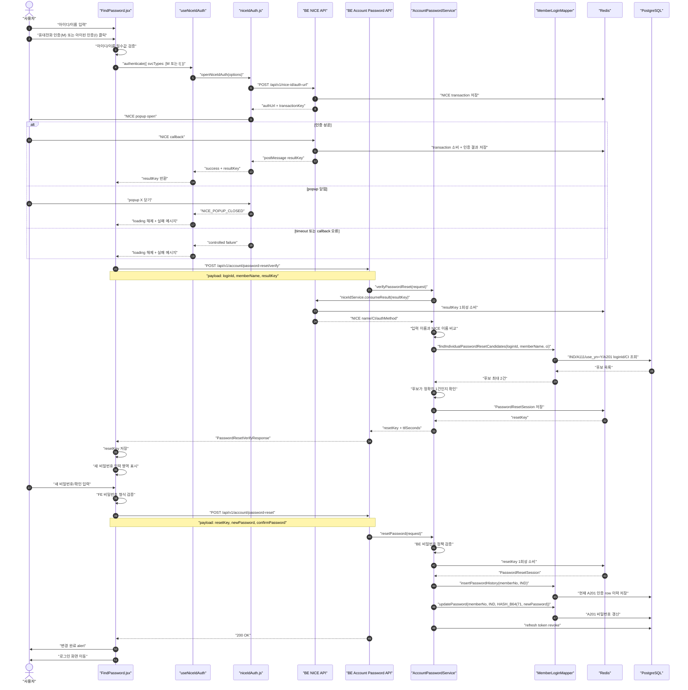

# 비밀번호 찾기 NICE 인증 흐름

## 1) 문서 목적

이 문서는 `비밀번호 찾기` 화면에서 개인회원이 NICE 인증을 완료한 뒤 새 비밀번호를 설정하는 전체 흐름을 정리합니다.

대상 화면은 `src/pages/FindPassword.jsx`입니다.

NICE 인증 popup 공통 처리는 `src/lib/niceIdAuth.js`와 `src/hooks/useNiceIdAuth.js`가 담당합니다.

백엔드 비밀번호 재설정 API는 `smep-be`의 `AccountPasswordController`, `AccountPasswordService`, `MemberLoginMapper.xml` 흐름을 탑니다.

현재 구현 범위는 개인회원입니다.

기업회원 공동인증서 기반 비밀번호 찾기는 아직 별도 계약이 닫히지 않았으므로 이 문서의 구현 범위에서 제외합니다.

## 2) 전체 흐름도

## 3) 프론트엔드 흐름

### 3.1 입력 단계

개인회원 탭에서 `아이디`와 `이름`을 입력합니다.

휴대전화 인증 버튼은 NICE 인증수단 `M`을 사용합니다.

아이핀 인증 버튼은 NICE 인증수단 `I`를 사용합니다.

아이디가 비어 있으면 `아이디를 입력해주세요.` alert를 표시합니다.

이름이 비어 있으면 `이름을 입력해주세요.` alert를 표시합니다.

### 3.2 NICE 인증 popup 단계

`FindPassword.jsx`는 `useNiceIdAuth.authenticate()`를 호출합니다.

`useNiceIdAuth`는 loading, error, result 상태를 관리합니다.

`niceIdAuth.js`는 `/api/v1/nice-id/auth-url`을 호출해 NICE 인증 URL을 발급받습니다.

인증 URL 발급 성공 후 `window.open()`으로 NICE popup을 엽니다.

popup이 정상 인증을 마치면 backend callback bridge가 opener로 `resultKey`를 postMessage합니다.

popup이 인증 없이 닫히면 `niceIdAuth.js`가 `popupWindow.closed`를 감지해 `NICE_POPUP_CLOSED` 실패로 종료합니다.

popup이 닫히거나 실패하면 loading이 해제되어 버튼 문구가 `인증하기`로 돌아와야 합니다.

### 3.3 회원 검증 단계

NICE 인증 성공 후 `FindPassword.jsx`는 `/api/v1/account/password-reset/verify`를 호출합니다.

요청 payload는 `loginId`, `memberName`, `resultKey`입니다.

검증 성공 응답에는 `resetKey`와 `expiresInSeconds`가 포함됩니다.

`resetKey`가 있으면 같은 화면 안에서 새 비밀번호 입력 영역을 표시합니다.

사용자가 아이디나 이름을 수정하면 기존 인증 결과, `resetKey`, 새 비밀번호 입력값을 초기화합니다.

### 3.4 새 비밀번호 변경 단계

새 비밀번호와 새 비밀번호 확인을 입력받습니다.

FE는 8~20자, 허용 문자, 조합 조건, 확인값 일치 여부를 먼저 검증합니다.

검증을 통과하면 `/api/v1/account/password-reset`을 호출합니다.

요청 payload는 `resetKey`, `newPassword`, `confirmPassword`입니다.

성공하면 `비밀번호가 변경되었습니다. 로그인해 주세요.` alert를 표시하고 `/service/login`으로 이동합니다.

## 4) 백엔드 흐름

### 4.1 NICE 인증 URL 발급

FE는 `/api/v1/nice-id/auth-url`을 호출합니다.

BE는 NICE transaction을 Redis에 저장하고, NICE 인증 URL과 transactionKey를 반환합니다.

transaction은 짧은 TTL로 저장됩니다.

### 4.2 NICE callback 처리

NICE 인증이 끝나면 NICE가 BE callback URL로 접근합니다.

BE는 transactionKey와 NICE callback 값을 검증합니다.

검증이 성공하면 NICE 인증 결과를 Redis에 저장하고, FE에 전달할 `resultKey`를 발급합니다.

`resultKey`는 raw CI/DI를 FE에 직접 노출하지 않기 위한 서버 측 handle입니다.

### 4.3 비밀번호 재설정 검증 API

URL은 `POST /api/v1/account/password-reset/verify`입니다.

Controller는 `PasswordResetVerifyRequest`를 받습니다.

Service는 `loginId`, `memberName`, `resultKey`를 필수값으로 검증합니다.

Service는 `resultKey`를 NICE 공통 서비스에서 1회성으로 소비합니다.

NICE 결과에 이름 또는 CI가 없으면 실패합니다.

사용자 입력 이름과 NICE 결과 이름이 다르면 실패합니다.

회원 조회는 `MemberLoginMapper.findIndividualPasswordResetCandidates`를 사용합니다.

조회 조건은 개인회원 `IND`, 정상회원 `A111`, 개인상세 `use_yn = 'Y'`, A201 로그인 ID, 회원명, CI 일치입니다.

CI는 같은 회원의 A203 또는 A201 인증 row 중 어디에 있어도 허용합니다.

기존 데이터에는 암호화 저장된 CI가 있으므로 원문 비교 후 암호문 후보는 `fn_comm_dec_b64`로 복호화 비교합니다.

후보가 정확히 1건이면 Redis에 `PasswordResetSession`을 저장하고 `resetKey`를 발급합니다.

후보가 0건이거나 2건 이상이면 회원정보 불일치로 실패합니다.

### 4.4 비밀번호 재설정 API

URL은 `POST /api/v1/account/password-reset`입니다.

Controller는 `PasswordResetChangeRequest`를 받습니다.

Service는 `resetKey`, `newPassword`, `confirmPassword`를 필수값으로 검증합니다.

`newPassword`와 `confirmPassword`가 다르면 실패합니다.

BE 비밀번호 정책은 `AccountPasswordPolicy.validateNewPasswordPolicy`를 사용합니다.

`resetKey`는 Redis에서 `getAndDelete` 방식으로 1회성 소비합니다.

비밀번호 변경 전에 현재 A201 인증 row를 `tb_mbrm_mbr_cert_h`에 이력으로 저장합니다.

비밀번호는 기존 정책과 동일하게 `HASH_B64(71, #{newPassword})`로 저장합니다.

변경 후 해당 회원의 refresh token을 삭제합니다.

## 5) Redis 사용 지점

NICE transaction은 인증 URL 발급 후 callback 상관관계를 유지하기 위해 Redis에 저장합니다.

NICE result는 raw CI/DI를 FE에 직접 전달하지 않기 위해 Redis에 저장하고 `resultKey`로만 참조합니다.

PasswordResetSession은 NICE 검증을 통과한 회원에게만 비밀번호 변경 권한을 짧게 부여하기 위해 Redis에 저장합니다.

`resultKey`와 `resetKey`는 모두 1회성 소비 구조입니다.

재시도할 때 이미 소비된 key를 다시 사용할 수 없습니다.

## 6) 주요 파일

### 6.1 FE

`src/pages/FindPassword.jsx`

- 비밀번호 찾기 화면입니다.
- 아이디/이름 입력, NICE 인증 시작, resetKey 수신, 새 비밀번호 입력, 비밀번호 변경 API 호출을 담당합니다.

`src/hooks/useNiceIdAuth.js`

- NICE 인증 호출을 React 상태로 감싸는 hook입니다.
- loading, error, result 상태를 제공합니다.

`src/lib/niceIdAuth.js`

- NICE 인증 URL 발급, popup open, postMessage 수신, timeout, popup 닫힘 처리를 담당합니다.

`src/lib/niceIdAuth.test.js`

- NICE 인증 popup wrapper의 주요 분기를 검증합니다.
- popup 수동 닫힘 케이스도 이 파일에서 검증합니다.

### 6.2 BE

`smep-be/src/main/java/kr/go/smes/niceid/api/NiceIdController.java`

- NICE 인증 URL 발급과 callback bridge를 담당합니다.

`smep-be/src/main/java/kr/go/smes/niceid/service/NiceIdService.java`

- NICE transaction 저장, callback 검증, resultKey 발급과 소비를 담당합니다.

`smep-be/src/main/java/kr/go/smes/account/api/AccountPasswordController.java`

- 비밀번호 찾기 검증 API와 비밀번호 재설정 API의 HTTP 진입점입니다.

`smep-be/src/main/java/kr/go/smes/account/service/AccountPasswordService.java`

- NICE resultKey 검증, 회원 매칭, resetKey 발급, 비밀번호 변경을 처리합니다.

`smep-be/src/main/resources/mappers/account/MemberLoginMapper.xml`

- 로그인 ID, 이름, CI 기준으로 개인회원 비밀번호 재설정 후보를 조회합니다.
- resetKey 소비 후 비밀번호 변경 이력 저장과 A201 비밀번호 갱신 SQL을 포함합니다.

`smep-be/src/main/java/kr/go/smes/account/store/PasswordResetTokenStore.java`

- resetKey와 PasswordResetSession을 Redis에 저장하고 1회성으로 소비합니다.

## 7) 주요 로그 마커

### 7.1 FE 로그

`[FIND_PASSWORD_MARK] personal auth start`

`[FIND_PASSWORD_MARK] personal auth success`

`[FIND_PASSWORD_MARK] personal auth failed`

`[FIND_PASSWORD_MARK] personal verify success`

`[FIND_PASSWORD_MARK] personal verify failed`

`[FIND_PASSWORD_MARK] reset submit start`

`[FIND_PASSWORD_MARK] reset submit success`

`[FIND_PASSWORD_MARK] reset submit failed`

### 7.2 BE 로그

`[PASSWORD_RESET_MARK] controller verify entry`

`[PASSWORD_RESET_MARK] controller verify response`

`[PASSWORD_RESET_MARK] service verify start`

`[PASSWORD_RESET_MARK] service verify nice-result consumed`

`[PASSWORD_RESET_MARK] service verify db-match count`

`[PASSWORD_RESET_MARK] service verify reset-key issued`

`[PASSWORD_RESET_MARK] controller reset entry`

`[PASSWORD_RESET_MARK] service reset start`

`[PASSWORD_RESET_MARK] service reset session consumed`

`[PASSWORD_RESET_MARK] service reset password-history inserted`

`[PASSWORD_RESET_MARK] service reset password-updated`

`[PASSWORD_RESET_MARK] service reset refresh-token revoked`

## 8) 실패 케이스별 동작

### 8.1 아이디 또는 이름 미입력

FE에서 alert를 표시하고 NICE 인증을 시작하지 않습니다.

### 8.2 NICE popup 차단

`NICE_POPUP_BLOCKED` 실패로 처리합니다.

FE loading은 해제되어야 합니다.

### 8.3 NICE popup 수동 닫힘

`NICE_POPUP_CLOSED` 실패로 처리합니다.

FE loading은 해제되어야 합니다.

버튼 문구는 `인증 중...`에서 `인증하기`로 돌아와야 합니다.

### 8.4 NICE callback timeout

지정된 timeout 안에 postMessage를 받지 못하면 `NICE_AUTH_TIMEOUT` 실패로 처리합니다.

FE loading은 해제되어야 합니다.

### 8.5 NICE 이름과 입력 이름 불일치

BE verify 단계에서 실패합니다.

사용자에게는 회원정보와 본인 인증 결과가 일치하지 않는다는 메시지가 전달됩니다.

### 8.6 CI 불일치

BE verify 단계에서 후보 0건이 되어 실패합니다.

기존 데이터의 CI가 암호화 저장되어 있는 경우를 위해 현재 SQL은 원문 비교와 복호화 비교를 함께 수행합니다.

### 8.7 resetKey 만료 또는 재사용

비밀번호 변경 API에서 실패합니다.

사용자는 NICE 인증부터 다시 진행해야 합니다.

## 9) 검증 상태

BE compile 검증은 `smep-be`에서 `./gradlew.bat compileJava`로 수행했습니다.

FE 단위 테스트는 `smep-ufe`에서 `npm test -- --run src/lib/niceIdAuth.test.js`로 수행했습니다.

FE lint 검증은 `npx eslint src/lib/niceIdAuth.js src/lib/niceIdAuth.test.js src/pages/FindPassword.jsx --max-warnings 0`로 수행했습니다.

CI 암호화 저장값 비교는 dev DB 읽기 전용 조회로 확인했습니다.

NICE popup 수동 닫힘 처리는 단위 테스트로 확인했습니다.

## 10) 아직 남은 실제 확인

개발서버 배포 후 실제 NICE popup에서 X 버튼으로 닫았을 때 버튼이 `인증하기`로 돌아오는지 확인해야 합니다.

개발서버 배포 후 실제 NICE 인증 성공 뒤 `resetKey`가 발급되고 새 비밀번호 입력 영역이 표시되는지 확인해야 합니다.

새 비밀번호 저장 후 로그인 화면으로 이동하는지 확인해야 합니다.

변경한 새 비밀번호로 실제 로그인이 되는지 확인해야 합니다.
